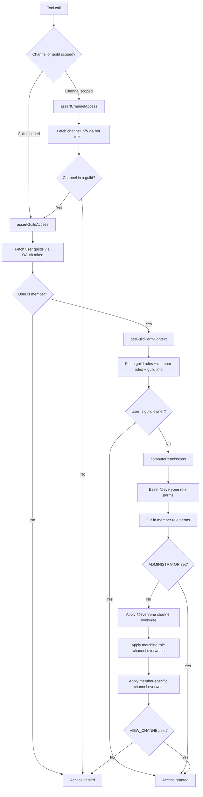
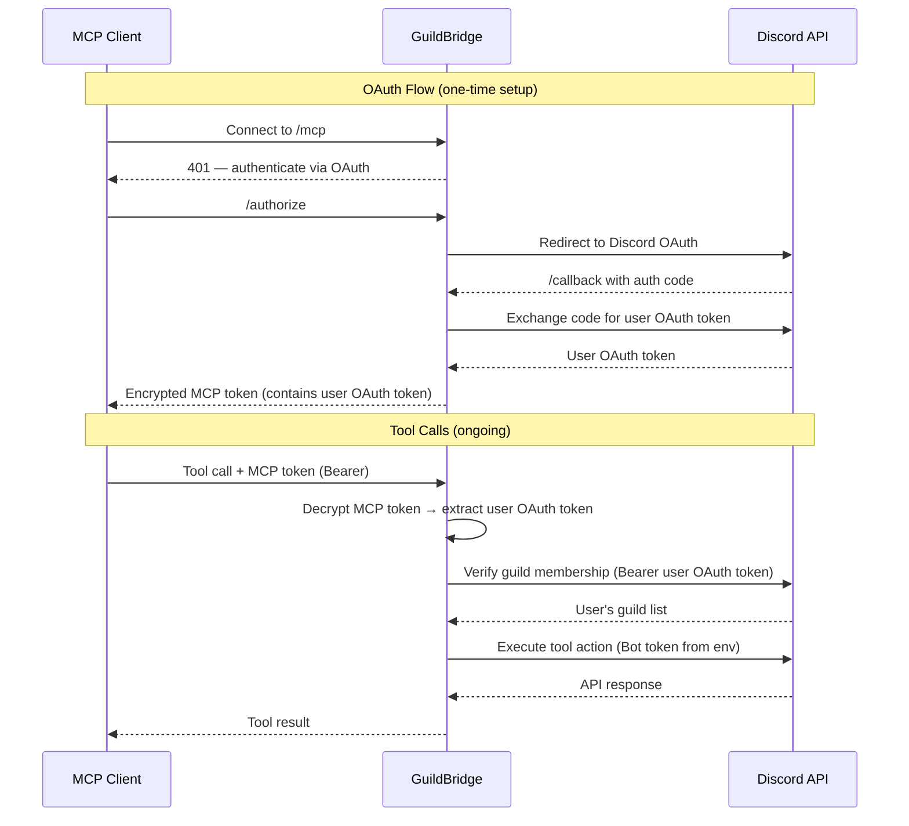

<h1>
<p align="center">
  GuildBridge
</h1>
  <p align="center">
    A remote MCP server for Discord, deployed on Cloudflare Workers.
    <br />
    <a href="#about">About</a>
    ·
    <a href="#tools">Tools</a>
    ·
    <a href="#access-control">Access Control</a>
    ·
    <a href="#token-usage">Token Usage</a>
    ·
    <a href="CONTRIBUTING.md">Contributing</a>
  </p>
</p>

## About

There is no official Discord MCP server, yet much of the coordination with contributors in the MCP community happens on Discord. GuildBridge fills that gap for me — it gives MCP clients authenticated, permission-aware access to Discord servers so that AI agents can read, search, and post messages where the conversation is already happening. It very much came to life on the heels of a problem that _I had_ that I solved by building my own MCP server.

>[!WARNING]
>The actual hosted version of this MCP server is not broadly available (I have restricted it to specific accounts and servers), but you can just as easily configure and deploy it yourself on your Cloudflare account.

>[!NOTE]
>When hosted, this MCP server authenticates users via [Discord OAuth2](https://discord.com/developers/docs/topics/oauth2) and makes all API calls with a [bot token](https://discord.com/developers/docs/reference#authentication). Role-Based Access Control (RBAC) is implemented server-side, as Discord's own auth surface doesn't enable a clean role separation and integration with messaging APIs in its OAuth implementation.

## Prerequisites

- [Node.js](https://nodejs.org/) (v18+)
- A [Cloudflare account](https://dash.cloudflare.com/) (using the free tier is sufficient)
- A [Discord application](https://discord.com/developers/docs/getting-started#creating-an-app) with:
  - A [bot user](https://discord.com/developers/docs/topics/oauth2#bots) added to the servers you want to access
  - [OAuth2](https://discord.com/developers/docs/topics/oauth2) configured (client ID + secret)

## Discord App Setup

1. Go to the [Discord Developer Portal](https://discord.com/developers/applications) and create (or select) an application.
2. Under **Bot**, click "Reset Token" to get your [bot token](https://discord.com/developers/docs/reference#authentication). Save it.
3. Under **OAuth2**, note the **Client ID** and **Client Secret**.
4. Under **OAuth2 > Redirects**, add your callback URL:
   - Local dev: `http://localhost:8788/callback`
   - Production: `https://<your-worker>.workers.dev/callback` (you will get this URI later when you deploy your MCP server to Cloudflare)
5. Under **OAuth2 > Scopes**, ensure [`identify` and `guilds`](https://discord.com/developers/docs/topics/oauth2#shared-resources-oauth2-scopes) are selected.
6. Under **Bot > Privileged Gateway Intents**, enable [**Message Content Intent**](https://discord.com/developers/docs/events/gateway#message-content-intent) if you want full message content in search results.
7. Invite the bot to your server(s) using the OAuth2 URL Generator with the `bot` scope and these [permissions](https://discord.com/developers/docs/topics/permissions#permissions-bitwise-permission-flags): `View Channels`, `Read Message History`, `Send Messages`.

## Local Development

```bash
# Install dependencies
npm install

# Copy the example files and fill in your values
cp wrangler.jsonc.example wrangler.jsonc
cp .dev.vars.example .dev.vars

# Start the dev server
npm run dev
```

The server runs at `http://localhost:8788`. The [MCP endpoint](https://modelcontextprotocol.io/docs/concepts/transports#streamable-http) is at `/mcp`.

### `.dev.vars`

>[!NOTE]
>You will need to fill this out prior to deployment to ensure that the MCP server can actually talk to Discord's APIs.

| Variable | Description |
|---|---|
| `DISCORD_CLIENT_ID` | OAuth2 client ID from Discord Developer Portal |
| `DISCORD_CLIENT_SECRET` | OAuth2 client secret |
| `DISCORD_BOT_TOKEN` | [Bot token](https://discord.com/developers/docs/reference#authentication) (used for all Discord API calls) |
| `COOKIE_ENCRYPTION_KEY` | Random string for signing cookies — generate with `openssl rand -hex 16` |
| `ALLOWED_DISCORD_USER_IDS` | Comma-separated [Discord user IDs](https://support.discord.com/hc/en-us/articles/206346498-Where-can-I-find-my-User-Server-Message-ID) allowed to authenticate (empty = all users) |

## Deploy to Cloudflare

```bash
# Create the KV namespace (https://developers.cloudflare.com/kv/)
npx wrangler kv namespace create OAUTH_KV
```

Copy the output `id` into `wrangler.jsonc` replacing `PLACEHOLDER_KV_ID`.

```bash
# Set secrets (https://developers.cloudflare.com/workers/configuration/secrets/)
npx wrangler secret bulk .dev.vars

# Deploy
npm run deploy
```

After deploying, [Wrangler](https://developers.cloudflare.com/workers/wrangler/) will print your worker URL (e.g. `https://guildbridge.<your-subdomain>.workers.dev`). Add `https://<your-worker-url>/callback` as a redirect URI in the Discord Developer Portal.

## Connect an MCP Client

Point any [MCP-compatible client](https://modelcontextprotocol.io/clients) at the server URL:

```
https://<your-worker>.workers.dev/mcp
```

Or locally:

```
http://localhost:8788/mcp
```

To test with the [MCP Inspector](https://modelcontextprotocol.io/docs/tools/inspector):

```bash
npx @modelcontextprotocol/inspector@latest
```

Enter the URL above, complete the Discord OAuth flow, and the tools will become available.

## Tools

| Tool | Description |
|---|---|
| `list_guilds` | List servers the bot is in |
| `list_channels` | List channels in a server (optionally filtered by type) |
| `get_channel_info` | Get channel details (topic, type, etc.) |
| `read_messages` | Read messages from a channel (with pagination) |
| `search_messages` | Search messages in a server (by content, channel, author) |
| `send_message` | Send a message to a channel |
| `reply_to_message` | Reply to a specific message |

## Access Control

Every tool call goes through a layered access check before touching the Discord API. Guild membership is verified via the user's OAuth token, and channel visibility is enforced by computing [Discord's permission algorithm](https://discord.com/developers/docs/topics/permissions#permission-overwrites) from the bot's perspective.



For `list_channels` and `search_messages`, the same [permission computation](https://discord.com/developers/docs/topics/permissions#permission-hierarchy) is applied as a post-filter — channels the user can't see are stripped from results.

## Token Usage

GuildBridge uses two distinct Discord tokens with intentionally separate roles:

| Token | Stored in | Used for |
|---|---|---|
| **Bot token** | Server-side env var (`DISCORD_BOT_TOKEN`) | All Discord API calls — reading messages, sending messages, fetching channels, roles, and members |
| **User OAuth token** | Encrypted inside the MCP access token | Guild membership verification only (`/users/@me/guilds`) |

The bot token never leaves the server. The user's Discord OAuth token is obtained during the [OAuth2 login flow](https://discord.com/developers/docs/topics/oauth2), embedded into an encrypted MCP access token, and returned to the MCP client. GuildBridge does not store the user's token server-side — the MCP client holds the encrypted token and sends it with each request, where it is decrypted to extract the OAuth token for guild membership checks.



During the OAuth flow, short-lived session state is managed via:

- **CSRF token** — HTTP-only cookie, validates the approval form submission (600s TTL)
- **State token** — stored in [Cloudflare KV](https://developers.cloudflare.com/kv/), binds the OAuth request across redirects (600s TTL)
- **Approved clients cookie** — HMAC-signed, lets returning users skip the approval dialog (30 days)

## Contributing

See [CONTRIBUTING.md](CONTRIBUTING.md) for setup instructions, code style guidelines, and how to submit changes. Please also review the [AI Usage Policy](AI_POLICY.md) before contributing.
