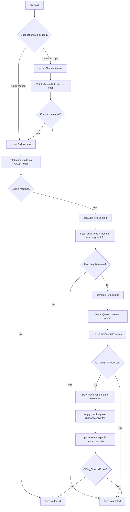

# GuildBridge

Remote MCP server for Discord, deployed on Cloudflare Workers. Exposes Discord read/search/post operations as MCP tools. Uses Discord OAuth to authenticate users and a Discord bot token for API calls.

## Prerequisites

- [Node.js](https://nodejs.org/) (v18+)
- A [Cloudflare](https://dash.cloudflare.com/) account
- A [Discord application](https://discord.com/developers/applications) with:
  - A **bot** added to the servers you want to access
  - **OAuth2** configured (client ID + secret)

## Discord App Setup

1. Go to the [Discord Developer Portal](https://discord.com/developers/applications) and create (or select) an application.
2. Under **Bot**, click "Reset Token" to get your bot token. Save it.
3. Under **OAuth2**, note the **Client ID** and **Client Secret**.
4. Under **OAuth2 > Redirects**, add your callback URL:
   - Local dev: `http://localhost:8788/callback`
   - Production: `https://<your-worker>.workers.dev/callback`
5. Under **OAuth2 > Scopes**, ensure `identify` and `guilds` are selected.
6. Under **Bot > Privileged Gateway Intents**, enable **Message Content Intent** if you want full message content in search results.
7. Invite the bot to your server(s) using OAuth2 URL Generator with the `bot` scope and these permissions: `View Channels`, `Read Message History`, `Send Messages`.

## Local Development

```bash
# Install dependencies
npm install

# Copy the example files and fill in your values
cp wrangler.jsonc.example wrangler.jsonc
cp .dev.vars.example .dev.vars

# Start the dev server
npm run dev
```

The server runs at `http://localhost:8788`. The MCP endpoint is at `/mcp`.

### `.dev.vars`

| Variable | Description |
|---|---|
| `DISCORD_CLIENT_ID` | OAuth2 client ID from Discord Developer Portal |
| `DISCORD_CLIENT_SECRET` | OAuth2 client secret |
| `DISCORD_BOT_TOKEN` | Bot token (used for all Discord API calls) |
| `COOKIE_ENCRYPTION_KEY` | Random string for signing cookies — generate one with `openssl rand -hex 16` |
| `ALLOWED_DISCORD_USER_IDS` | Comma-separated Discord user IDs allowed to authenticate (empty = all users allowed) |
| `CF_ACCESS_TEAM_DOMAIN` | Cloudflare Access team name — required for the admin panel |
| `CF_ACCESS_AUD` | Cloudflare Access Application Audience (AUD) tag — required for the admin panel |
| `DEV_SKIP_CF_ACCESS` | Set to `true` to bypass CF Access JWT validation in local dev |

## Deploy to Cloudflare

The Worker binds to three stateful Cloudflare resources: a **KV namespace** (OAuth state + allowlist), a **D1 database** (audit log), and a **Zero Trust Access application** (gates `/admin`). You can provision all three at once with Terraform, or create them individually with the wrangler CLI.

### Option A — Terraform

Provisions KV, D1, and the Access app + policy in one shot. Requires a Cloudflare API token with `Workers KV Storage:Edit`, `D1:Edit`, and `Access: Apps and Policies:Edit` scopes.

```bash
cd terraform
cp terraform.tfvars.example terraform.tfvars
# edit terraform.tfvars — set account ID, worker hostname, admin emails

export CLOUDFLARE_API_TOKEN=...
terraform init
terraform apply
```

Wire the outputs into your config:

| Output | Goes into |
|---|---|
| `kv_namespace_id` | `wrangler.jsonc` → `kv_namespaces[0].id` |
| `d1_database_id` | `wrangler.jsonc` → `d1_databases[0].database_id` |
| `d1_database_name` | `wrangler.jsonc` → `d1_databases[0].database_name` |
| `cf_access_aud` | `wrangler secret put CF_ACCESS_AUD` |

Then apply the D1 schema, set the remaining secrets, and deploy:

```bash
cd ..
npx wrangler d1 migrations apply "$(terraform -chdir=terraform output -raw d1_database_name)" --remote
npx wrangler secret bulk .dev.vars
terraform -chdir=terraform output -raw cf_access_aud | npx wrangler secret put CF_ACCESS_AUD
npm run deploy
```

If you used Terraform, skip the **Setup** subsections under [Admin Panel](#admin-panel) and [Observability](#observability) — those resources already exist.

### Option B — Manual (wrangler CLI)

```bash
# Create the KV namespace
npx wrangler kv namespace create OAUTH_KV
```

Copy the output `id` into `wrangler.jsonc` replacing `PLACEHOLDER_KV_ID`. (D1 and Access setup are covered under [Observability](#observability) and [Admin Panel](#admin-panel) below.)

```bash
# Set secrets (bulk upload from your .dev.vars file)
npx wrangler secret bulk .dev.vars

# Deploy
npm run deploy
```

---

After deploying, Wrangler will print your worker URL (e.g. `https://guildbridge.<your-subdomain>.workers.dev`). Add `https://<your-worker-url>/callback` as a redirect URI in the Discord Developer Portal.

## Connect an MCP Client

Point any MCP client at the server URL:

```
https://<your-worker>.workers.dev/mcp
```

Or locally:

```
http://localhost:8788/mcp
```

To test with the MCP Inspector:

```bash
npx @modelcontextprotocol/inspector@latest
```

Enter the URL above, complete the Discord OAuth flow, and the tools will become available.

## Tools

| Tool | Description |
|---|---|
| `list_guilds` | List servers the bot is in |
| `list_channels` | List channels in a server (optionally filtered by type) |
| `get_channel_info` | Get channel details (topic, type, etc.) |
| `read_messages` | Read messages from a channel (with pagination) |
| `search_messages` | Search messages in a server (by content, channel, author) |
| `send_message` | Send a message to a channel |
| `reply_to_message` | Reply to a specific message |

## Admin Panel

The admin panel at `/admin` lets you add and remove allowed Discord users at runtime, without redeploying. It stores the allowlist in KV and the OAuth callback checks both the KV allowlist and the `ALLOWED_DISCORD_USER_IDS` env secret (union of both).

### Setup

1. In the [Cloudflare Zero Trust dashboard](https://one.dash.cloudflare.com/), create an **Access Application** for `<your-worker-domain>/admin*`.
2. Configure an identity provider (email OTP, Google, etc.).
3. Copy the **Application Audience (AUD)** tag and set it as the `CF_ACCESS_AUD` secret.
4. Set the `CF_ACCESS_TEAM_DOMAIN` secret to your Zero Trust team name.

Once deployed, visit `https://<your-worker>.workers.dev/admin` to manage the allowlist.

For local development, set `DEV_SKIP_CF_ACCESS=true` in `.dev.vars` to bypass CF Access JWT validation, then visit `http://localhost:8788/admin`.

### Migration from env secret

1. Both KV and `ALLOWED_DISCORD_USER_IDS` are checked (union). The admin panel manages KV only.
2. Once all users are added via the panel, run `npx wrangler secret delete ALLOWED_DISCORD_USER_IDS` to remove the env secret.

## Observability

Every MCP tool invocation is audited. Events are dual-written to **D1** (ordered audit trail, queryable from the admin panel's Activity tab) and **Analytics Engine** (fire-and-forget metrics, queried via the Cloudflare dashboard SQL API).

**Captured per event:** timestamp, tool name, Discord user ID + username, outcome (ok/error), duration, `guild_id` (when present), `channel_id` (when present), created `message_id` (for `send_message`/`reply_to_message`), error message (on failure). Message content and search queries are never captured.

### Setup

```bash
# Create the D1 database (one-time)
npx wrangler d1 create guildbridge-audit
```

Copy the output `database_id` into `wrangler.jsonc` replacing `PLACEHOLDER_D1_ID`, then apply the schema:

```bash
# Local dev
npx wrangler d1 migrations apply guildbridge-audit --local

# Production
npx wrangler d1 migrations apply guildbridge-audit --remote
```

Analytics Engine requires no setup — the `TOOL_AUDIT` binding in `wrangler.jsonc` is enough. In local dev, `writeDataPoint` is a no-op stub; it only writes when deployed.

### Querying

**Admin panel:** `https://<your-worker>.workers.dev/admin` → Activity tab. Filter by tool or user ID.

**D1 directly:**

```bash
npx wrangler d1 execute guildbridge-audit --command \
  "SELECT * FROM audit_log ORDER BY ts DESC LIMIT 20"
```

**Analytics Engine** (aggregates):

```bash
npx wrangler analytics-engine sql \
  "SELECT blob1 AS tool, count() AS calls, avg(double1) AS avg_ms
   FROM guildbridge_tool_calls
   WHERE timestamp > now() - INTERVAL '7' DAY
   GROUP BY tool"
```

Field mapping: `indexes[0]` = userId, `blobs` = `[tool, username, outcome, guildId, channelId, messageId, error]`, `doubles` = `[durationMs]`.

## Access Control

Every tool call goes through a layered access check before touching the Discord API. Guild membership is verified via the user's OAuth token, and channel visibility is enforced by computing Discord's effective permissions from the bot's perspective.



For `list_channels` and `search_messages`, the same permission computation is applied as a post-filter — channels the user can't see are stripped from results.

## Project Structure

```
src/
  index.ts               # MCP server (tools) + OAuthProvider export
  discord-handler.ts     # Discord OAuth flow (Hono routes)
  discord-api.ts         # Discord REST API helpers + types
  utils.ts               # OAuth token exchange + Props type
  workers-oauth-utils.ts # CSRF/session/state management
  admin.ts               # Admin panel UI + API (allowlist + activity log)
  cf-access.ts           # Cloudflare Access JWT validation middleware
  audit.ts               # Tool-call audit: D1 + Analytics Engine writes
migrations/
  0001_create_audit_log.sql  # D1 schema for the audit trail
terraform/
  main.tf                    # KV + D1 + Zero Trust Access app/policy
  variables.tf               # account ID, worker hostname, admin emails
  outputs.tf                 # IDs for wrangler.jsonc, AUD for secret
```
